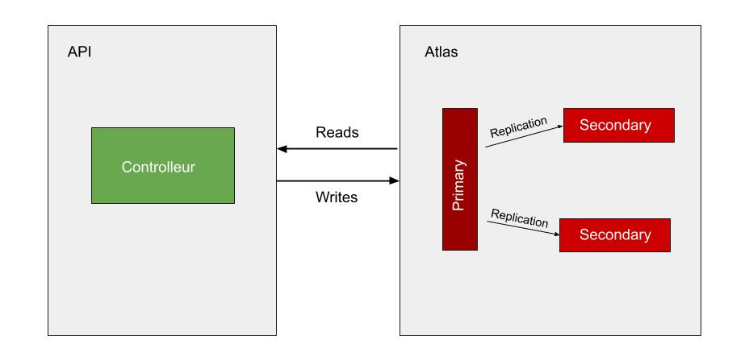

# Optimisation et Performance

### Docker
- Installer Docker
- `docker-compose up --build`

### MongoDB Atlas
- Créer un Projet
- Construire un nouveau cluster
- Sélectionner une instance gratuite de 512MO (Ireland)
- Créer un nom utilisateur / mot de passe pour se connecter avec notre application REST dans **Databas Access** et un nouvel IP dans **Network Acess** avec *Add current IP Adress*
- Cliquer sur **Connect** dans **Clusters**, cliquer sur *Connect your Application* et copier coller le lien du "Connection String Only" dans *db.js* en faisant attention a bien sélectionner la VERSION de Node.js

### Installer le projet
- `git clone https://github.com/SolenneD/mds_m1_daguerre_solenne_optimperf.git`
- `cd mds_m1_daguerre_solenne_optimperf`
- `npm install`
- `node app.js`

### Information globale
- Nom du projet : Project 0
- Nom du cluster : Cluster0

### Route de l'API
**Create** (POST)
- http://localhost:3301/tasks
- Insèrer une tâche dans la base de donnée
    - *nameFestival* (required)
    - *countryFestival* (required)
- Exemple : 
`` 
{
  "nameFestival": "Airbeat One Festival",
  "countryFestival": "Belgique"
}
``

**Search** (GET)
- http://localhost:3301/tasks
- Lister toutes les taches dans la base de donnée

**Read** (GET)
- http://localhost:3301/tasks/:id
- *:id* --> copier / coller un ID d'une tâche
- Permettre de lire un élément dont l'id a été donné

**Update** (PUT)
- http://localhost:3301/tasks/:id
- *:id* --> copier / coller un ID d'une tâche
- Modifier un ou les éléments d'une tâche dont l'id a été donné
    - *nameFestival*
    - *countryFestival*
- Exemple : ``
    {
	"countryFestival": "Allemagne"
    }
``

**Delete** (DELETE)
- http://localhost:3301/tasks/:id
- *:id* --> copier / coller un ID d'une tâche
- Supprimer une tâche dont l'id a été donné

### Schématisation Architecture
